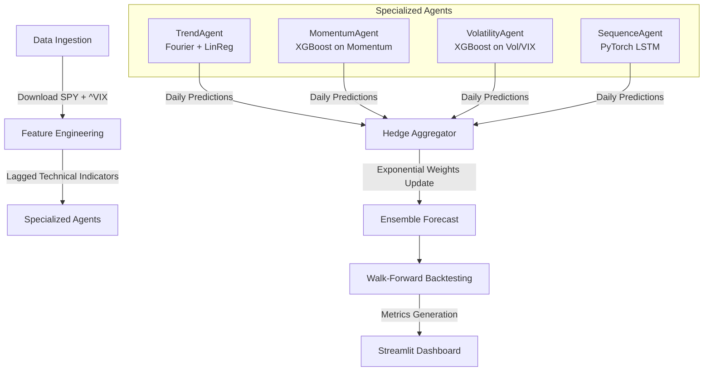

# Multi-Agent Financial Forecasting System

An end-to-end quantitative forecasting pipeline that leverages a multi-agent framework to predict SPY log returns. The system features specialized machine learning models (agents), dynamic weight aggregation via the **Hedge algorithm**, a rolling walk-forward backtesting framework, and a Streamlit-based visualization dashboard.

---

## 🏗️ System Architecture

The pipeline processes financial market data through a series of modular stages:



1. **Data Ingestion (`data/fetch.py`)**: Fetches SPY daily prices and VIX index level data using `yfinance` with automated retry logic.
2. **Feature Engineering (`pipeline/features.py`)**: Constructs technical indicators (RSI, MACD, Bollinger Band Width) and lagged returns.
3. **Specialized Agents (`pipeline/agents.py`)**:
   * **TrendAgent**: Generates linear trend lines fitted on Calendar Fourier seasonal components.
   * **MomentumAgent**: XGBoost trained on momentum indicators (`rsi_14`, `macd_signal`, and log return lags).
   * **VolatilityAgent**: XGBoost trained on market volatility indicators (`bb_width`, rolling stds, VIX levels).
   * **SequenceAgent**: PyTorch LSTM model mapping sequences of historical log returns to predict future movements.
4. **Hedge Referee (`pipeline/aggregator.py`)**: Operates as a dynamic online ensemble referee. Updates agent weights exponentially according to their daily Mean Squared Error (MSE) loss.
5. **Backtester (`pipeline/backtest.py`)**: Runs a robust walk-forward rolling train-test simulation, strictly lagging features by 1 day to enforce **no-leakage discipline**.
6. **Dashboard (`app.py`)**: Visualizes cumulative returns, individual agent weights over time, and compares performance metrics.

---

## 📈 Backtest Performance Results

*Below are the simulated backtesting metrics from 2013 to 2024 (SPY benchmark)*:

| Strategy / Model | MAE | Directional Accuracy | Sharpe Ratio | Max Drawdown | Information Ratio |
| :--- | :---: | :---: | :---: | :---: | :---: |
| **Buy & Hold** | 0.006470 | 55.51% | 0.786 | 33.72% | 0.000 |
| **Hedge Ensemble** | 0.006993 | 53.44% | 0.706 | 33.72% | -0.133 |
| **SequenceAgent (LSTM)** | 0.006973 | 53.74% | 0.672 | 33.72% | -0.200 |
| **TrendAgent** | 0.007004 | 52.77% | 0.447 | 37.62% | -0.422 |
| **Equal Weight** | 0.007013 | 51.97% | 0.337 | 44.32% | -0.548 |
| **VolatilityAgent** | 0.007215 | 52.14% | 0.141 | 33.17% | -0.634 |
| **MomentumAgent** | 0.007370 | 51.07% | -0.136 | 60.69% | -0.779 |

---

## 🚀 Getting Started

### 1. Installation
Clone the repository and install dependencies:
```bash
git clone https://github.com/Snehil06/Multi-Agent-Forecasting.git
cd Multi-Agent-Forecasting
pip install -r requirements.txt
```

### 2. Run the Backtest Pipeline
To download market data, build features, train all agents, and run the walk-forward backtest, run:
```bash
python -m pipeline.backtest
```
This updates the CSV results located inside `results/`.

### 3. Launch the Streamlit Dashboard
Visualize the predictions, weights, and returns interactively:
```bash
streamlit run app.py
```
